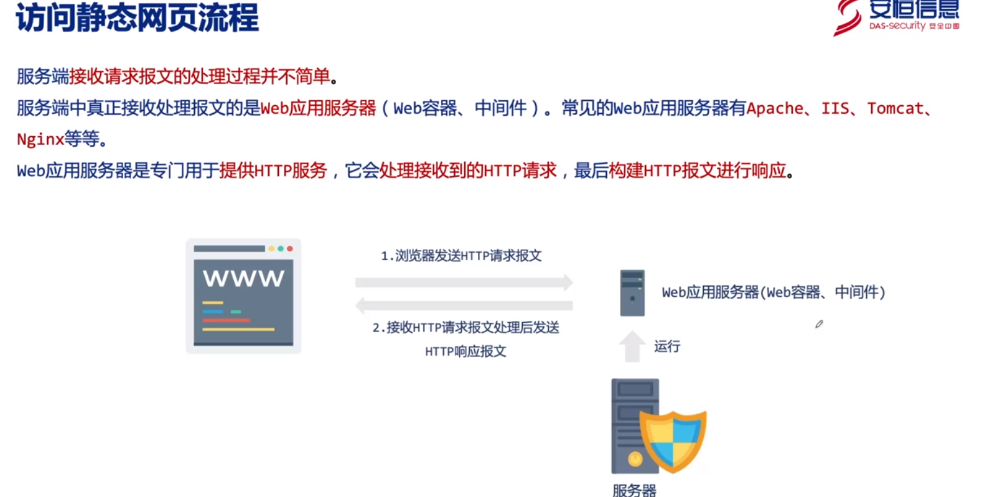
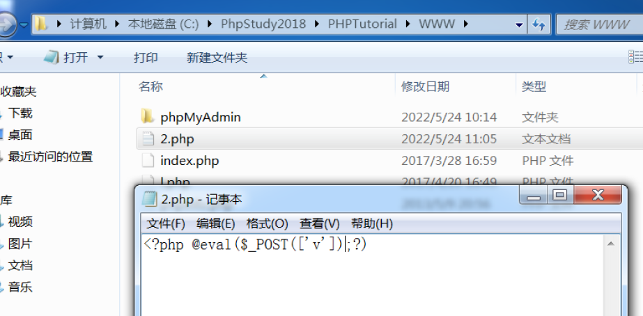
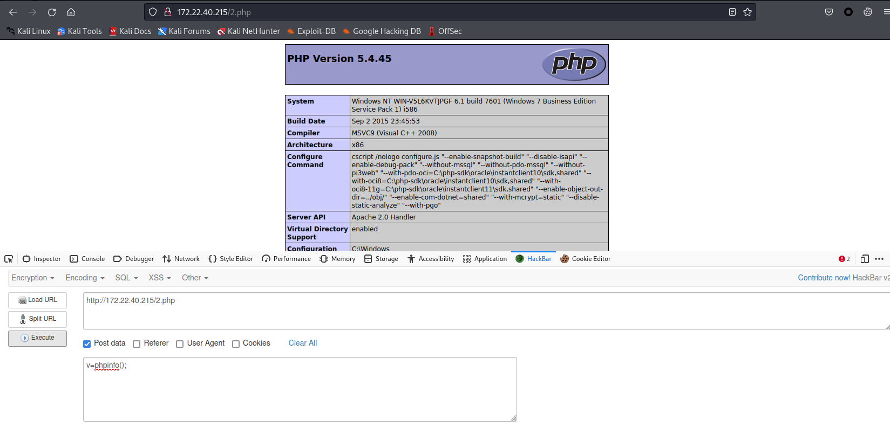
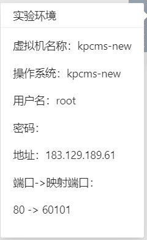
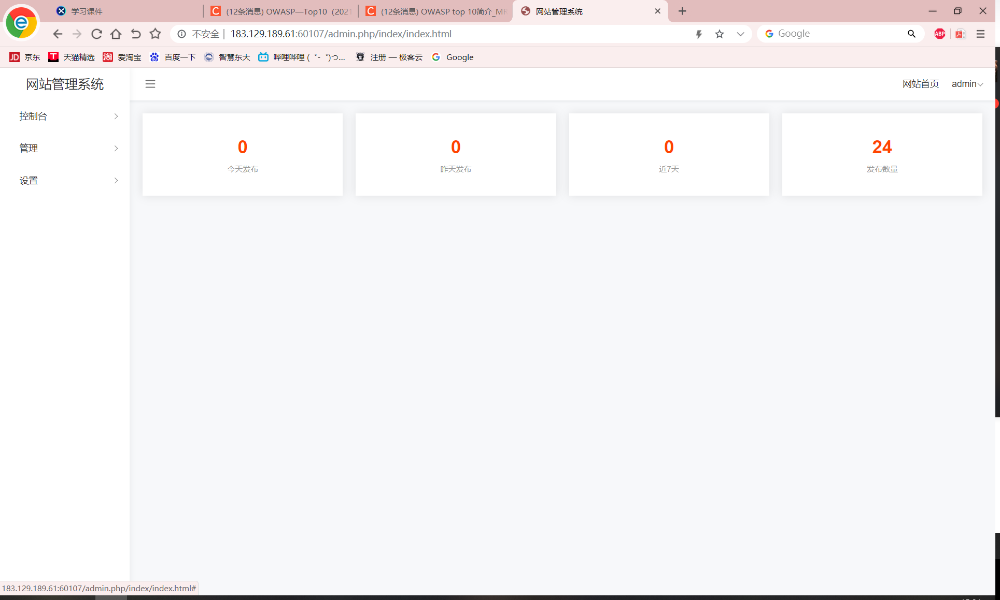
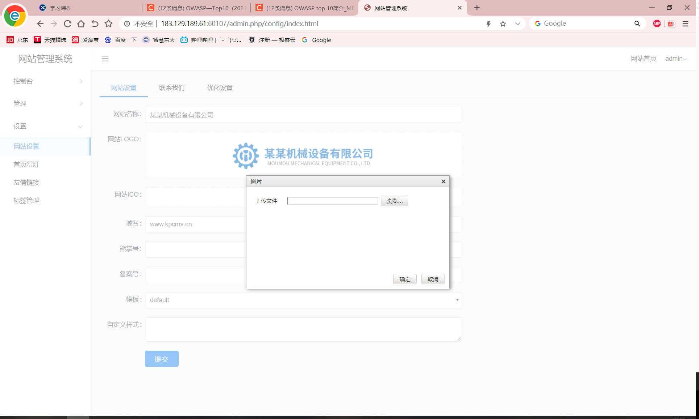
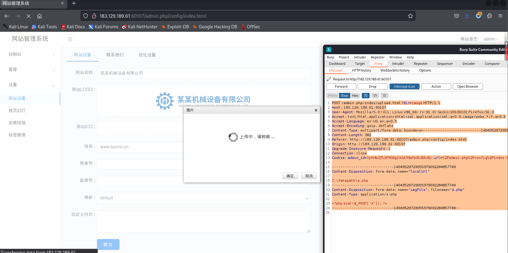
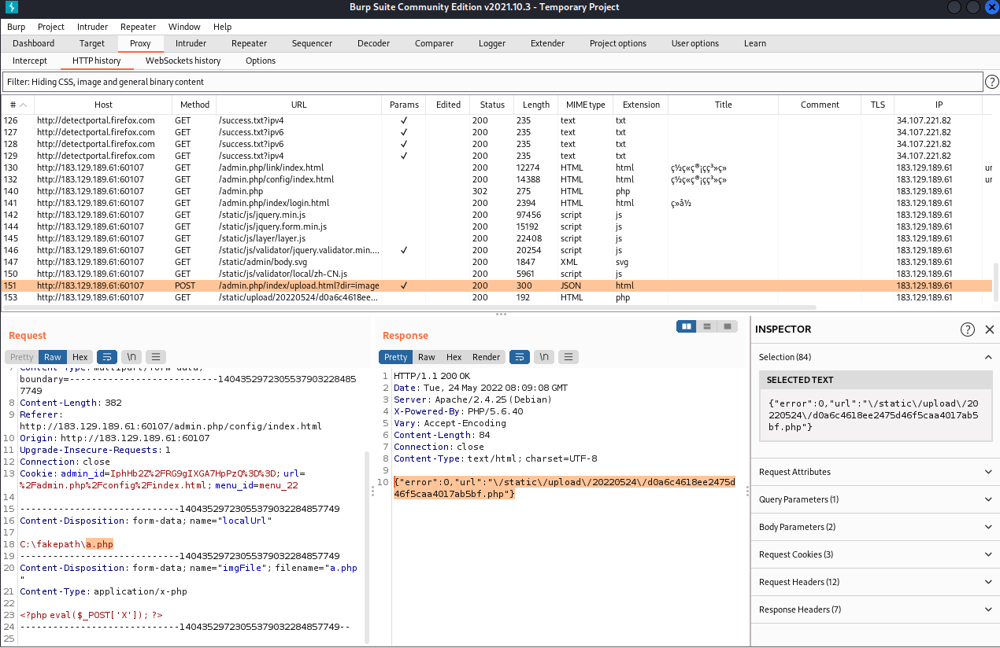

# Web应用安全

## 1. web安全基础

什么是web应用？——提供web服务的应用系统，通俗的讲就是一个网站

**web 分为服务端和客户端**

**Web应用服务器如何处理请求？**

客户端➡http请求报文➡Apache➡根目录检索➡http相应报文➡客户端

**什么是静态网页？**——以`.htm \ .html`为后缀的文件，通常由HTML+CSS+JavaScript构成

**什么是渲染解析**——源代码➡网页

**动态网页**——以`.php\.jsp\.asp\.aspx`为后缀的文件，内容由HTML+CSS+JavaScript+后端代码构成

**动态网页请求服务器**

php代码只做业务逻辑上的处理，数据最终被存储在数据库中。如果代码中涉及到对数据库的操作，脚本引擎会请求数据库进行操作。

**常见架构**

| 操作系统      | Web应用服务器 | 动态脚本引擎 | 数据库服务 |
| ------------- | ------------- | ------------ | ---------- |
| Windows       | IIS           | ASP（.NET）  | SQL Server |
| Windows/Linux | Apache        | PHP          | MySQL      |
| Windows/Linux | Tomcat        | Jsp          | Oracle     |

## 2.常用的Web渗透工具

-  Firefox浏览器
  - hackbar
  - cookie_edit
  - proxy
- BurpSuite——http的请求拦截和修改，扫描web应用程序漏洞，暴力破解登录单。

## 3.Web的常见漏洞利用与防护

- 输入输出验证不充分
- 设计缺陷
- 环境缺陷

### 3.1 WebShell 和WebShell管理工具

WebShell —— 网页后门，是运行在Web应用之上的远程控制程序。实质上是一张网页，由php Jsp等语言开发，一般具有**文件管理、端口扫描、提权、获取系统信息**等功能

WebShell管理工具 ——蚁剑

#### 一句话木马（复现）

在如下目录下添加文件

然后利用hackbar发送命令得到版本信息

我们再让它输出一句hello world，也成功执行

### 3.2 文件上传漏洞原理和利用方式

**原理** ——假设文件上传功能没有对上传文件进行限制，可以上传能被服务端解析的文件，并通过此文件获得执行服务端命令的能力（WebShell）

**场景**——后台弱口令+文件上传漏洞

**防御方法：**

- 检测文件类型，大小，后缀。
- 最小权限运行Web服务
- 上传文件目录修改权限，不给上传文件执行权限，读写权限分离
- 安装WAF，安全狗，阿里云盾

**复现**

拿到环境

用一个莫名其妙的端口进去了

发现一个文件上传点

上传一句话木马并抓包，找到上传的数据包，并找到路径

### 3.3 任意文件下载漏洞

**原理**——没有对下载的文件类型、目录做合理的过滤，导致任意文件下载

危害：可以下载站点源码、系统配置文件等

**防御**：

- 下载路径不可控
- 根据ID下载
- 对参数进行严格过滤，不能进行目录遍历

### 3.4 SQL注入

**原理**——在输入的字符串之中注入SQL指令，数据库服务器会误认为是正常的SQL指令而运行。

联合注入，输出字段数需要和前一个语句一样

`select * from zgyz where student_name = '`+`'union select 0,1,2,3';`

MySQL 5.0 版本以上自带一个数据库：`information_schema`，该数据库存放了这个MySQL所有数据库和数据表的元信息。

**防御**——SQL语句预编译、选择足够严格的过滤机制

### 3.5 XSS漏洞原理及利用方式

什么是**JavaScript**——脚本语言，可以使网页拥有交互能力。

**XSS** —— 跨站脚本攻击，攻击者在页面插入恶意脚本代码

**原理**——实质是HTML注入，用户的输入被当作HTML代码执行

- 反射型XSS —— 非持久，主要存在于URL地址栏和搜索框，主要用于钓鱼
- 存储型XSS —— 将用户输入的数据存储在服务端（留言板、发帖、回帖）

**危害**：

- 钓鱼
- cookie
- 获取IP
- 重定向

### 3.6 CSRF漏洞原理及利用方式

**CSRF**——跨站请求伪造 ：利用未失效的会话信息，伪装目标用户发起请求执行目标网站接口。在受害者不知情的情况下，以受害者名义伪造请求发送给攻击站点。

CSRF危害：

- 以别人的名义发邮件
- 盗取账号
- 购买商品，虚拟货币转账
- 

**防御**

- Samesite Cookie
- 验证 HTTP Referer 字段
- 增加Token验证

### 3.7 逻辑漏洞

危害：

- 大量敏感数据泄露，越权访问
- 商品低价支付

### 3.8 RCE漏洞

**RCE** —— 远程命令/代码执行漏洞

### 3.9  Apache Http多后缀解析漏洞

用户配置不当造成的漏洞

### 3.10 IIS常见漏洞

**IIS解析漏洞**——影响版本 IIS 5.x -> 6.0 

利用方式：

- 该解析漏洞 `;`后面的后缀不会解析
- shell.asp;.jpg

### 3.11 Nginx解析漏洞

用户配置不当造成

### 3.12 Tomcat 后台弱口令&&get shell

